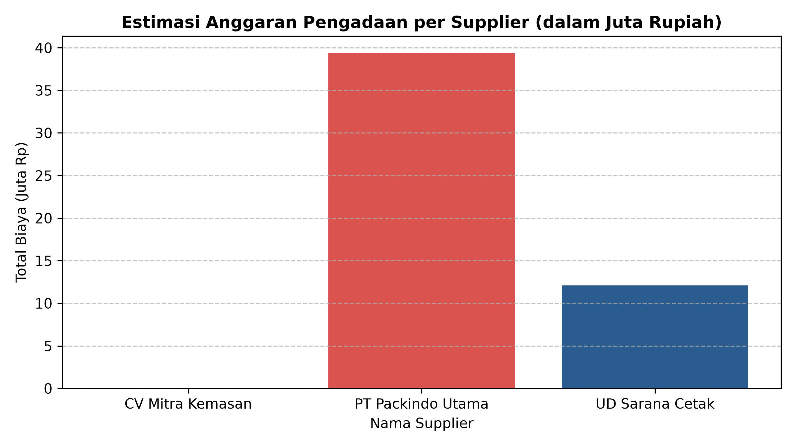

# 📦 Inventory Control & Purchase Order (PO) Optimization Analysis


Proyek ini bertujuan untuk mengoptimalkan manajemen persediaan (*inventory control*) dan otomatisasi alur pemesanan barang (*Purchase Order*) menggunakan Python (Pandas). Analisis ini dirancang untuk mencegah terjadinya *stockout* (kehabisan stok) operasional serta memberikan estimasi kebutuhan anggaran pengadaan secara presisi berbasis data.

---

## 🎯 Latar Belakang & Masalah
Dalam operasional pengadaan barang (*purchasing/procurement*), keterlambatan pemesanan ulang (*reorder*) seringkali menyebabkan proses operasional terhenti. Di sisi lain, pemesanan berlebih dapat mengakibatkan akumulasi *dead stock* dan pemborosan arus kas.

**Tujuan Proyek:**
- Mengotomatisasi penentuan titik pemesanan kembali menggunakan metode **Reorder Point (ROP)**.
- Menghasilkan *actionable alerts* (Status: `PESAN SEKARANG` vs `STOK AMAN`).
- Menghitung rekomendasi kuantitas pemesanan (*Suggested Order Quantity*) untuk siklus 30 hari ke depan.
- Mengestimasi total anggaran pengadaan (*Estimated PO Cost*) per barang dan supplier.

---

## 📊 Metodologi & Formula Perhitungan

1. **Reorder Point (ROP):**
   $$\text{ROP} = (\text{Daily Usage} \times \text{Lead Time Days}) + \text{Safety / Minimum Stock}$$

2. **Status Pemesanan (Order Alert):**
   $$\text{Status} = \begin{cases} \text{"PESAN SEKARANG"}, & \text{jika } \text{Stock On Hand} \le \text{ROP} \\ \text{"STOK AMAN"}, & \text{jika } \text{Stock On Hand} > \text{ROP} \end{cases}$$

3. **Suggested Reorder Quantity (Target Kebutuhan 30 Hari):**
   $$\text{Qty Pesan} = (\text{Daily Usage} \times 30) - \text{Stock On Hand}$$

4. **Estimated PO Cost:**
   $$\text{Total Cost} = \text{Suggested Reorder Quantity} \times \text{Unit Cost}$$

---

## 🚀 Struktur Direktori

## 📊 Hasil Analisis & Visualisasi Dashboard

### 1. Visualisasi Distribusi Anggaran Pengadaan


### 2. Status Monitoring Stok & Action Plan (Purchase Order)
| Kode Barang | Nama Barang | Supplier | Stok Saat Ini | Reorder Point (ROP) | Rekomendasi Pesan (Unit) | Estimasi Biaya PO (Rp) | Status |
| :--- | :--- | :--- | :---: | :---: | :---: | :---: | :---: |
| **BRG-001** | Kardus Box A1 | PT Packindo Utama | 150 | 275 | **600** | Rp 3.000.000 | 🔴 PESAN SEKARANG |
| **BRG-002** | Lakban Bening | CV Mitra Kemasan | 450 | 120 | 0 | Rp 0 | 🟢 STOK AMAN |
| **BRG-003** | Plastik Bubble Wrap | PT Packindo Utama | 80 | 210 | **370** | Rp 31.450.000 | 🔴 PESAN SEKARANG |
| **BRG-004** | Label Stiker Resi | UD Sarana Cetak | 600 | 260 | 0 | Rp 0 | 🟢 STOK AMAN |
| **BRG-005** | Tali Strapping | PT Packindo Utama | 40 | 75 | **110** | Rp 4.950.000 | 🔴 PESAN SEKARANG |
| **BRG-006** | Kertas A4 80gr | UD Sarana Cetak | 20 | 74 | **220** | Rp 12.100.000 | 🔴 PESAN SEKARANG |

> 💡 **Key Takeaway:** Total anggaran pengadaan yang dibutuhkan untuk 4 barang kritis adalah **Rp 51.500.000,-** dengan alokasi terbesar pada pengadaan bahan proteksi packaging di *PT Packindo Utama*.
```text
├── Purchasing_data.csv       # Dataset operasional inventaris & supplier
├── Purchasing_data_analys.py # Script otomasi analisis data menggunakan Pandas
└── README.md                 # Dokumentasi proyek